# Synacor Challenge Writeup

Disclaimer: this is more of a report than a walkthrough, lots of blabbering and unnecessary details. Also, **if you do plan on playing the challenge, do not keep on reading, as the whole thing is spoiled below.**

## 1. Eight Passwords

The challenge's basic idea is that I am expected to code a virtual machine (in whichever language - I chose Python) of a very specific architecture, and run the included binary. While going through that, I would find eight passwords to input on the website to track my progress.

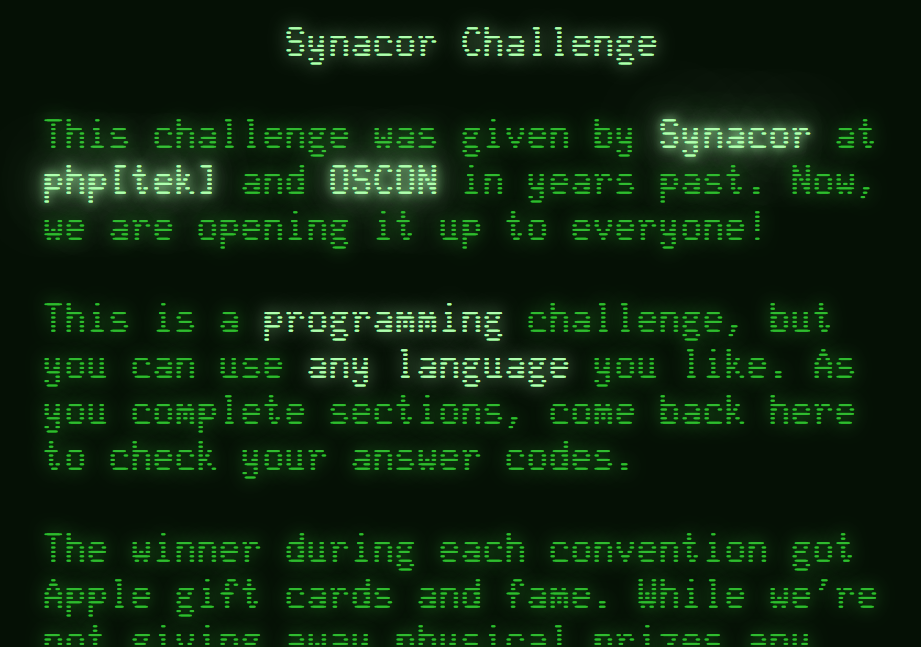

The first thing I noticed is that I had to sign up first before I was able to get my hands on the challenge files. After playing with the website a little bit, I found out that that's because the passwords are generated for each specific account, so people aren't able to cheat their way through!

When downloading the [.tar package](synacor-challenge.tar), I was presented with two files: [arch-spec](arch-spec.txt) (with no file extension) and [challenge.bin](challenge.bin). Upon further inspection, the first one is a .txt, while the other has random garbage when viewed in a text editor (so, it's an actual binary).

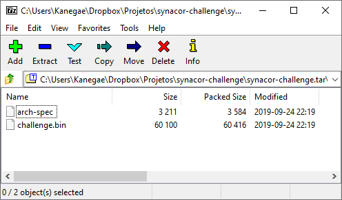

The arch-spec filename is pretty self-explanatory. It describes the architecture you should emulate, complete with instruction formats, storage regions and opcodes. Within the hints sections, I found the first password!

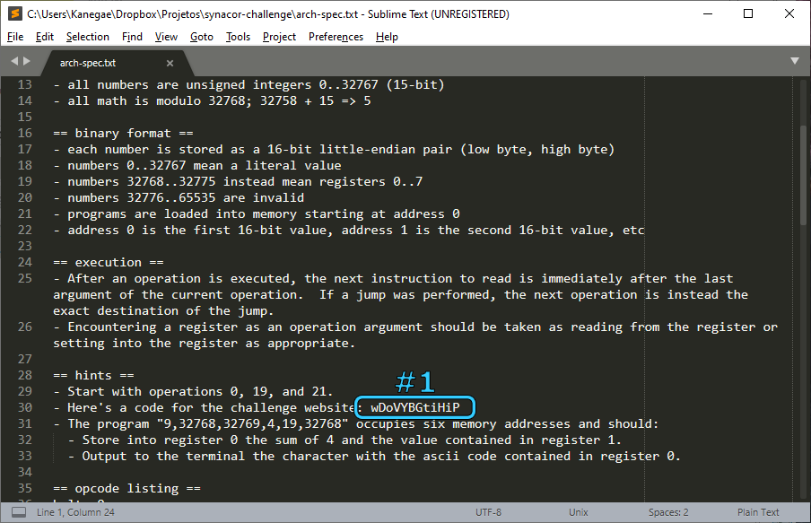

When taking a peek at challenge.bin with hexdump, I'm able to read some stuff amongst the garbage... "Welcome to the Synacor Challenge"...? Huh. A couple characters later, there it is - the second password! And I didn't even have to code anything yet! In hindsight, that was probably not the intended way to get that one.

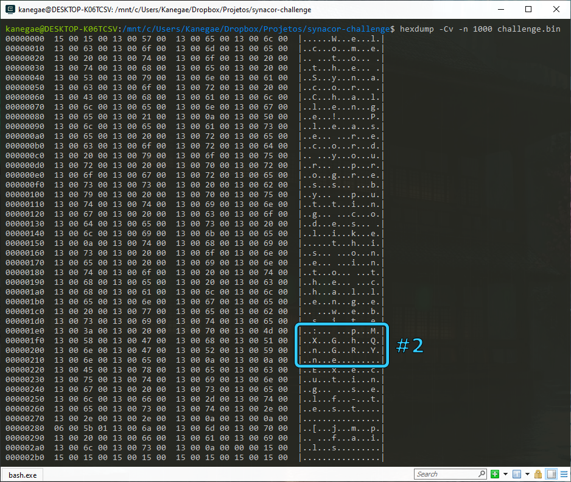

After a couple minutes of reading the architecture description, it sounded like a pretty simple one, without any special tricks or anything like that. I also noticed that reading raw bits wouldn't be of much help, so I threw a couple quick and dirty lines of Python together to make a disassembler, based on the opcodes described.

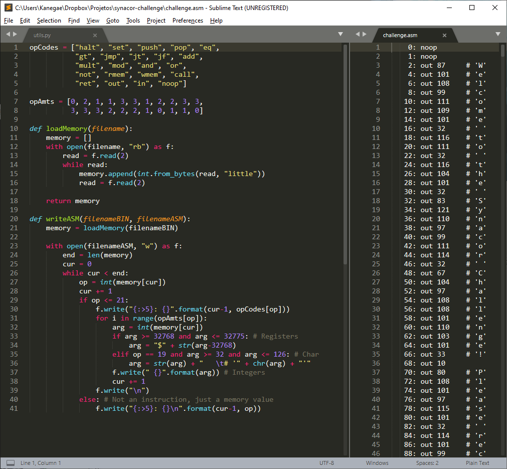

Now I started to see the full picture: eight registers, 32K memory (same addressable space for both data and instructions), 22 operations and a hefty program ahead of me. By looking through my now readable disassembled code, I could see that the first couple hundred lines were quite obvious: lots of printing to the screen, a welcome message, the aforementioned second password, and some kind of "self-test"...? I figured the program itself tested the virtual machine before running any relevant code, to see if all necessary instructions were actually implemented. There I went, then!

## 2. Mom, I made a Virtual Machine!

Arrays to represent memory, registers and stack, a program counter variable, a somewhat infinite loop, tons of conditional statements and around an hour of trial and error. Here, the main difficulty was that the instruction arguments could be either an immediate value or a register, and I had to write code generic enough to account for both.

Well, that's what it took for me to get to the next part. I was definitely on the right track, as this is what popped up in my terminal:

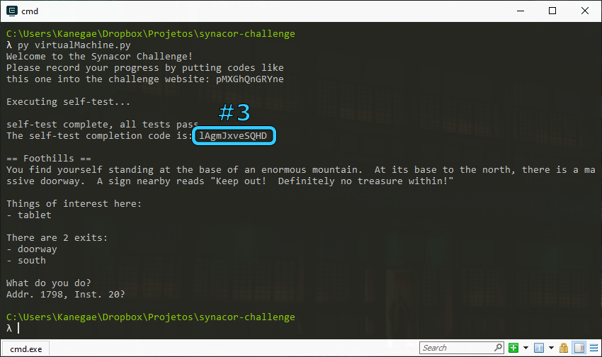

Self-tests passed, third password get! Now to the good part: a text-based adventure game! That sounds fun! How could I not find that when giving the source code a quick look? Well, obviously, the code is heavily obfuscated. To get to this point, the virtual machine had to run over 600k instructions.

Before going any further, my debug code alerted me that I hadn't implemented instruction 20 yet. As you could guess per the game output, that was the input instruction.

And then I hit my first roadblock. Apparently, that instruction stores one character per register/memory address, but Python, being as high-level as it is, has a couple issues with that. By going back to my disassembled code, the instruction that follows the input one compares what was read with 10, the ASCII for the newline character. I had to find a way around Python's built-in function for that to work, as it ignores newlines from the standard input. So, I coded an InputBuffer class, as I learned in my Computer Organization class. Or was it Digital Systems? Oh, well.

Back to the, now functional, adventure game!

## 3. Is this [Zork](https://en.wikipedia.org/wiki/Zork)?

When typing nothing and so activating that newline branch, the game suggests to me that I type 'help' to see my options, those being verbs like 'look', go', 'take', 'use', as well as accessing my inventory. So, I take the tablet that's in "front" of me, and I use it. Hooray, the fourth code!

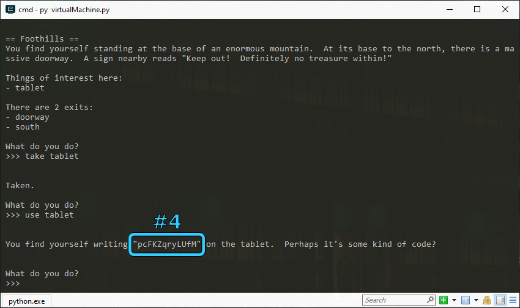

After playing for a few more minutes, I found an empty lantern, and kept dying to [grues](https://zork.fandom.com/wiki/Grue).

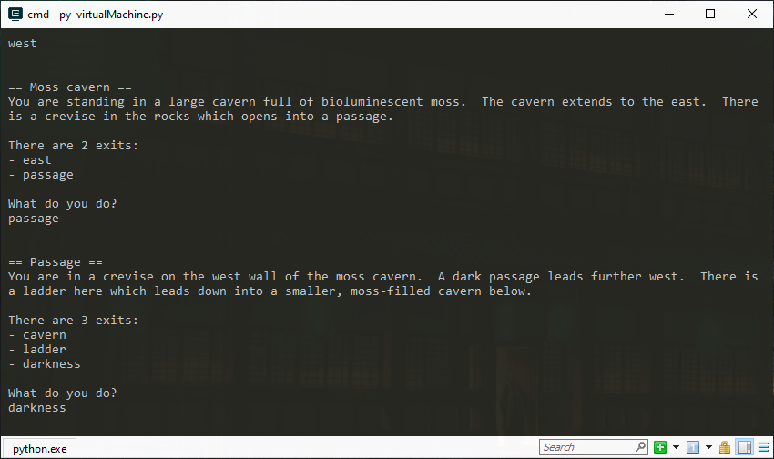

I quickly hacked a savefile-esque feature, so I could store my previous commands and go right back to a certain point I was before.

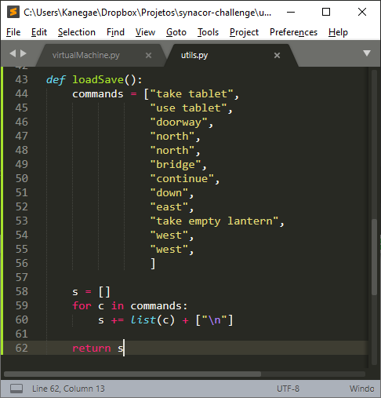

Using my freshly implemented save states, I reached some ["twisty little passages, all alike"](https://en.wikipedia.org/wiki/Colossal_Cave_Adventure), and by navigating via trial-and-error, I found the fifth password!

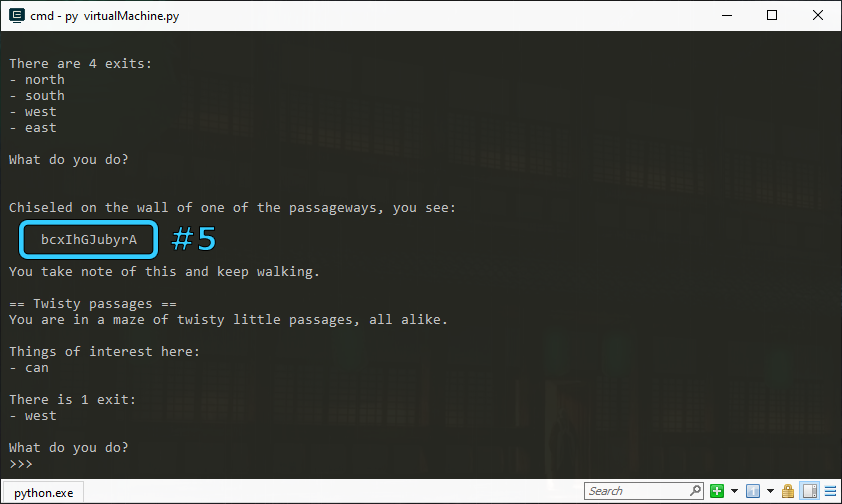

## 4. Rich Ruins

By recording each and all of my steps, I end up in a "massive central hall of these ruins", with an equation with five blanks. After finding a red coin and placing it on the monument thing, the leftmost blank is now a 2. Should I get more coins? Should I go back to the assembly code? Nah, this is fun, I will keep playing the game.

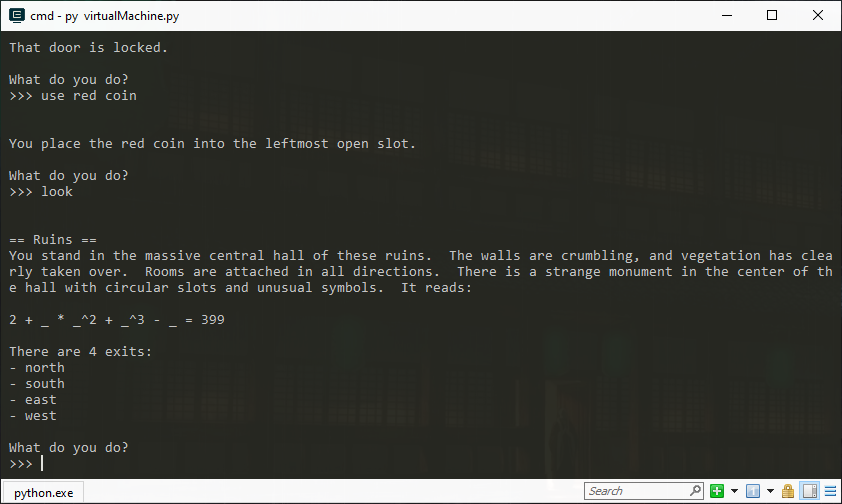

I finally find all the five coins. I place them all, and... they all fall onto the floor? What? Is there a specific order to them?

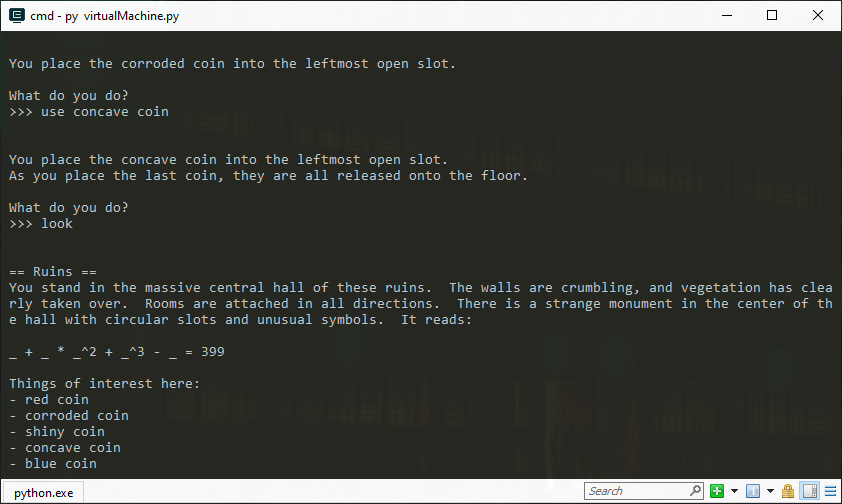

I go on my actions array (i.e. "savefile") and remove all the "use [something] coin"s. Let's see... When trying them one by one, I see that they all go into the leftmost open slot, and the red, corroded, shiny, concave and blue coins have values 2, 3, 5, 7 and 9, respectively. I'll get some paper. Or some code!

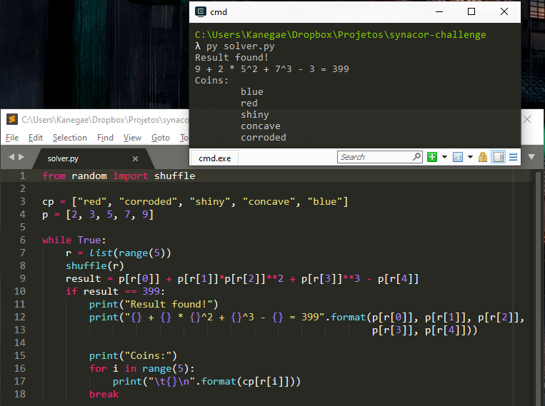

A door opens. Someone left a teleporter(!) on the ground.

## 5. Interdimensional Physics Lessons

I decide to use it. I'm now stuck in a dead end, which apparently is Synacor's Headquarters! When I teleported myself, the sixth password appeared! Two left!

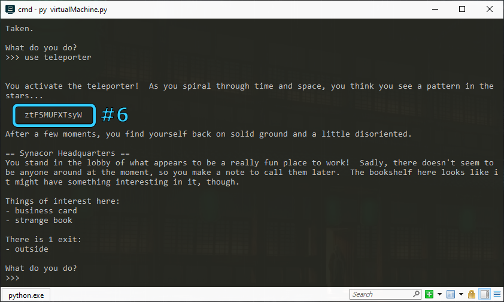

There's a physics book laying on the ground, that on further inspection talks about "eight pockets of energy called 'registers'", and how the "eight register" should be at a specific value to unlock another teleport destination. It tells me that, "if in an alternate dimension with nothing but a hand-held teleporter", I should "extract the confirmation algorithm and optimize it". Aw, shoot. There we go back to programming. That was a fun text game!

My first thought is to bruteforce it. The architecture arithmetic is modulo 32768, so the specific value has to be between 1 and 32767, as 0 is the "default destination". The problem is... the program's starting self-check blocks me from starting it with any value other than 0! Well, let's see where $7 (the eight register, in my assembly code) is mentioned. There are 4 instructions that use it: 521, 5451, 5522, and 6042. What if I replace the instruction 521 with something else, thus disabling the self-test, and then set $7 to something other than 0? I did! It ran! Huh...

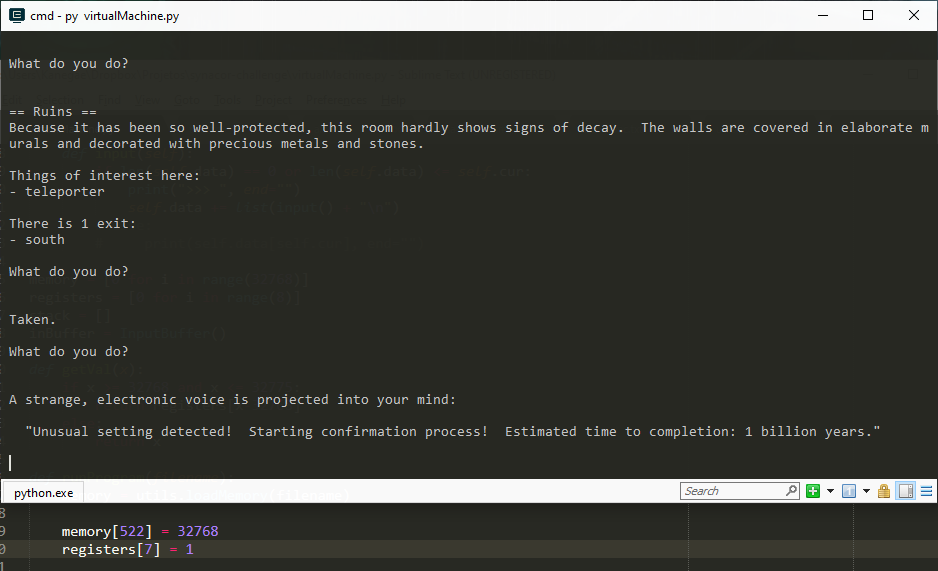

Yeah, bruteforce is not gonna cut it. I will have to reverse engineer the program. Apparently I am supposed to find the "teleportation confirmation algorithm", but that seemed too abstract. I figured I would just dive in the assembly code and see what I got.

## 6. Knee-Deep in Assembly

The first 1400 instructions or so were just the self-test, so nothing interesting to see there. Lots of binary operations and arithmetic showed that whatever was there, was quite hidden. I did find out that if you set memory address 782 to 7, you get a "not hitchhiking" error on the self-test! [Neat](https://youtu.be/N_dUmDBfp6k?t=30)!

After over an hour of commenting some disassembled code and labeling more than a handful of jumps, I noticed that there were some addresses that were called a LOT: 1458 and 1518. What could that be? The 'print' function, or even the input one? Maybe I should try to find where the game strings are stored. And there I went: and there I found... nothing. From the address 6000-ish onwards, there were just a bunch of numbers, no ASCII or any other character encoding known to me. But those have to come out of somewhere, I thought. My next not-so-bright idea was to run the program dumping its whole memory everytime it printed something to the screen, taking my computer a couple minutes and generating a 2.2GB text file. And there the strings were:

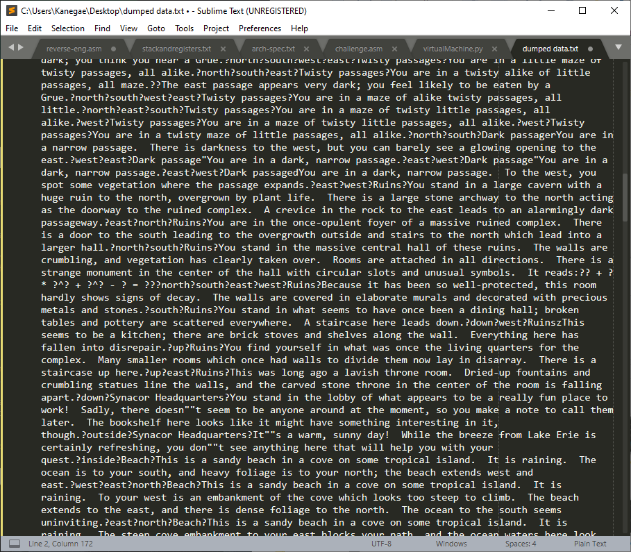

At some point in the program, those integers were decrypted and turned into valid ASCII characters. And that had to happen early, as there were no readable strings other than the self-test ones. By logging the memory reads and writes, I locked in the decryption algorithm: addresses 1730 and 2125, the second one called twice for each memory address. I also found the lower and upper bounds of the decoded addresses: 6068 (found at address 1727) and 30050 (found at address 1755). Now I just had to extract that decryption algorithm and run it for all of those addresses. That's why the "self-test" took over 600k instructions to run!

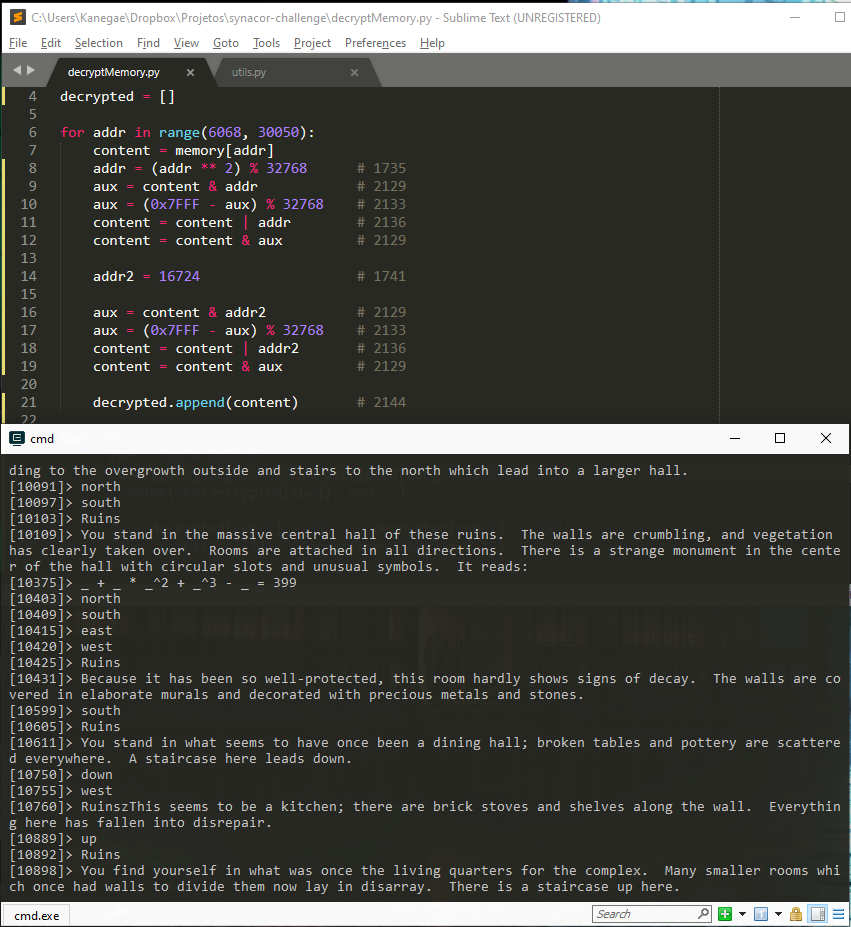

That's better! Although I'm not too sure how that helps me, other than finding "spoilers" of unseen locations like the Tropical Island, Tropical Cave and Vault (containing [elerium-115](https://xcom.fandom.com/wiki/Elerium)!), which appear to be related, as well as a new item: a journal that's about orbs, hourglasses and puzzles. Would that island be the secret teleportation destination, and where that journal is located? Hmm. No new passwords found when decrypting the memory, though. I also noticed that, although the decryption algorithm runs until address 30049, everything from address 26850 and beyond is not valid ASCII. I wonder what that is, guess I'm gonna keep a mental note on that.

A couple more hours getting more and more familiarized with the code, understanding how the disassembled print function works, how the strings are stored, and all that... just for fun, really. After I got tired of that, I figured I would get back on track.

## 7. One Billion Years Cut Short

As before, disabling the register self-check and modifying the contents of the eighth register triggers the "1 billion years" text, which, when going through my debug logs, I saw that it resulted in what looked like an infinite loop, filling the stack forever. It's pretty much looping the last instructions of the program, starting at address 6027.

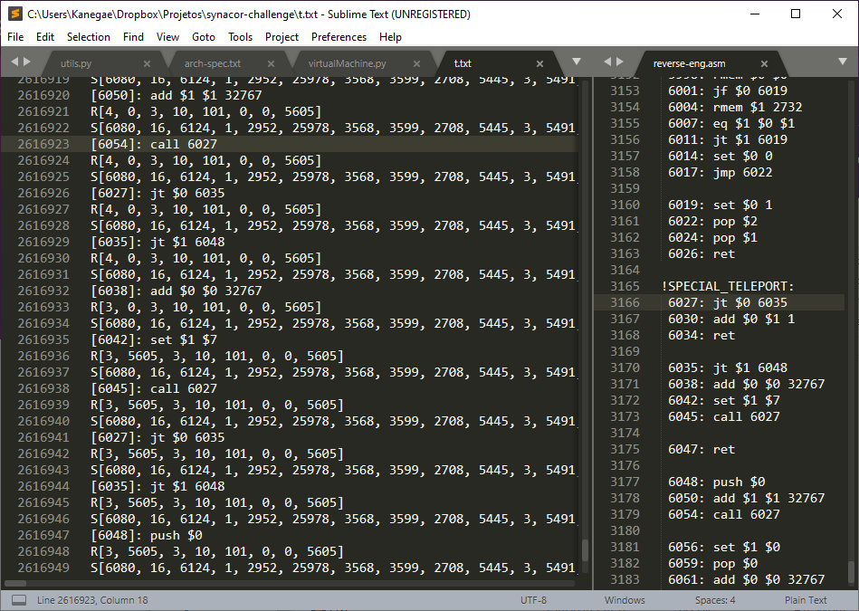

So, when a nonzero value at $7 is detected, it will run the "teleportation confirmation algorithm", called at address 5489. What if I just... remove that instruction? "Miscalibration detected! Aborting teleportation!". Well, the next instruction, at 5491, checks if $0 is 6 to continue. May as well also disable that one! And there it was, the seventh code:

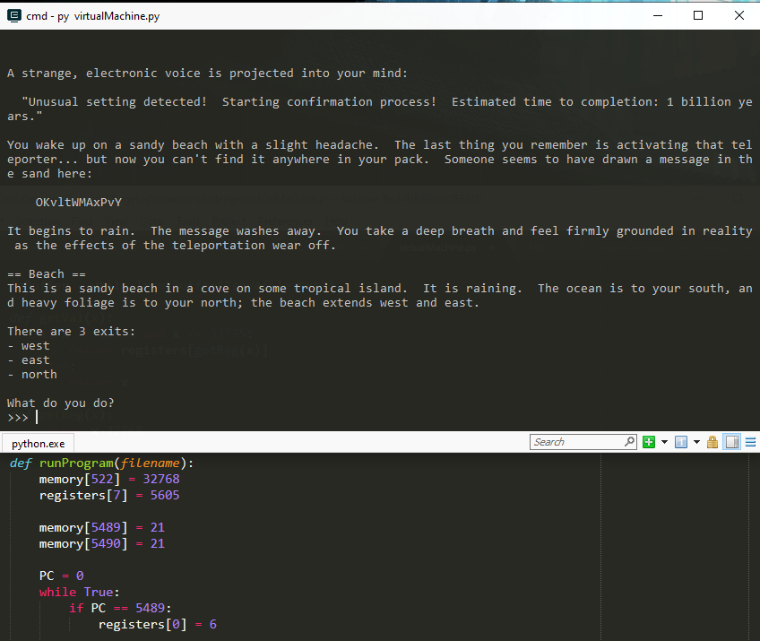

Which, for some reason, is refused by the website. Maybe because I kinda cheated? The physics book did warn me that "if it is even slightly off, the user would (probably) arrive at the correct location, but would briefly experience anomalies in the fabric of reality itself", as well as "if it is set incorrectly, the now-bypassed confirmation mechanism will not protect you!", which probably means that the value stored at $7 is used to generate the password, meaning that I do have to get the correct one to proceed.

By extracting the piece of code from address 6027 and beyond, and more or less converting it to a more familiar language, Python, I get what is clearly a recursive function with three arguments, the first two defined as 4 and 1 at addresses 5483 and 5486, just before the algorithm is called.

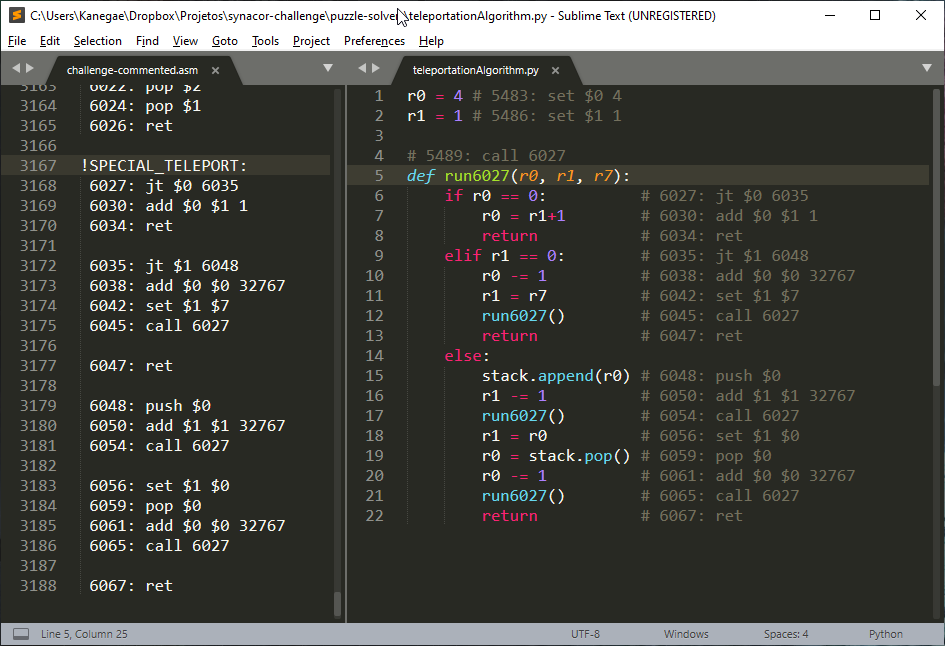

Running the code above with all the boilerplate stuff doesn't really help. The recursion is quite heavy and it does seem like it would take "1 billion years", indeed.

After being stuck for an hour or two, I tried Googling for some famous recursive algorithm or mathematical function that would behave like this, and I couldn't find much. But I did come across results that reminded me of some of my first Introduction to Computer Science classes, where we discussed recursion, and the [Ackermann Function](https://en.wikipedia.org/wiki/Ackermann_function). Clearly, I was onto something.

Actually, the implemented algorithm wasn't exactly it, but instead a modified version of the regular one, in which the second condition calls the second argument as the value at $7 (address 6042). The initial values for $0 and $1 are 4 and 1, respectively, and after running the "confirmation mechanism", it checks for $0 being 6.

Now, the instructions from the book made way more sense: "the confirmation mechanism would be very computationally expensive", as the modified Ackermann function is; "you will need to extract the confirmation algorithm, reimplement it on more powerful hardware, and optimize it", so I need to run it with whatever optimizations I can think of, and "set the eighth register to this value, activate the teleporter, and bypass the confirmation mechanism", which is already bypassed by removing instructions 5489 and 5491. So, I had to find a value k for which ackermann(4, 1, k) evaluates to 6.

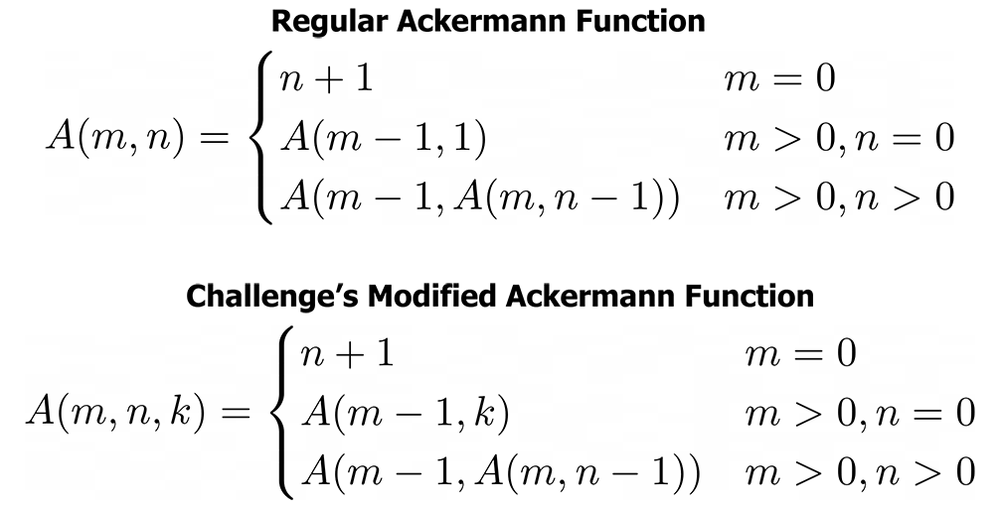

As a side note, the code actually uses $0 as the first argument ("m") as well as to return the computed value, and $1 as the second argument ("n"). The stack is used once simply to store the value of $0 and restore it after a recursion is called.

Then, I fell back to the good old C language, which would give me way better performance than Python. My first thought on optimizing the recursion was to implement a memoization technique, storing a table of previous values, independent to each k tried. Alongside that, I had to keep in mind that all math was modulo 32768, as well as the property from the Ackermann function that all subsequent function calls have an equal or smaller "m", so I wouldn't need a 32768x32768 memoization matrix (that would be over a billion values!).

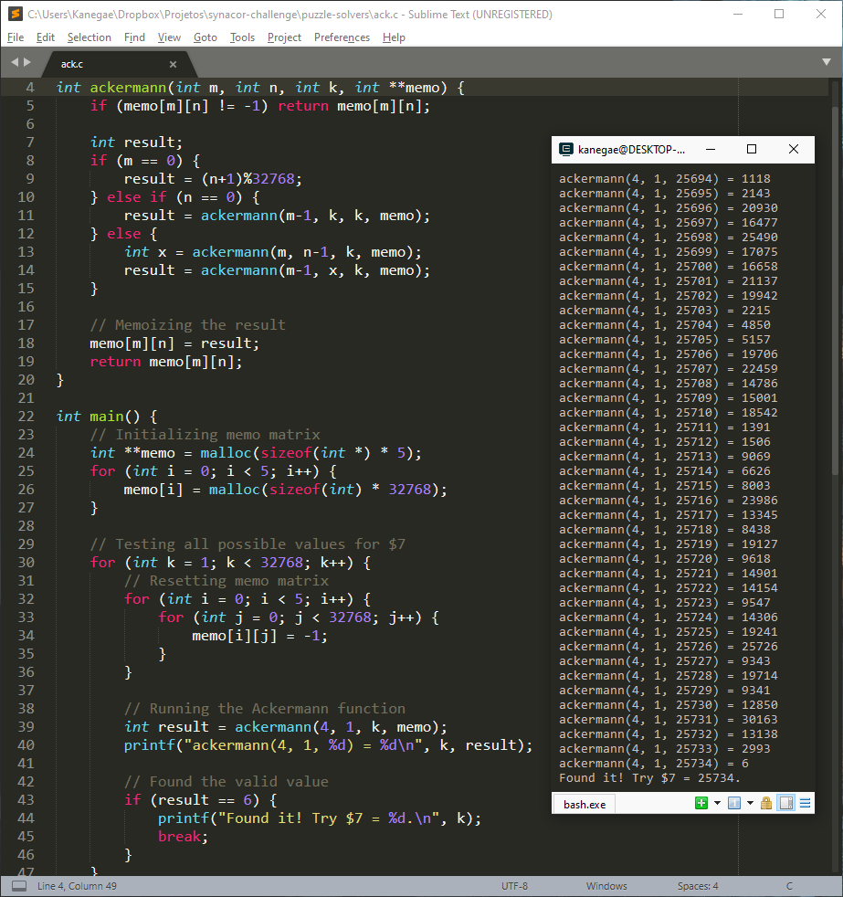

After a few seconds, my code spew out a value that met the conditions! I set $7 to that while keeping the "confirmation mechanism" turned off, and I had a new password!

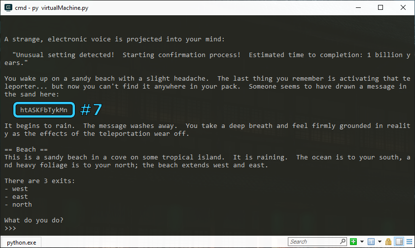

And this time, it worked. Phew, that was not easy!

## 8. Breaking Into The Vault

Back to the adventure game, then! I'm at the Tropical Island, a location spoiled by decrypting the game strings before. I find the aforementioned journal in an alcove nearby, describing what appeared to be another math puzzle. A little more walinkg, and I'm in the Vault Antechamber, in which the elements around me match exactly what the journal had described. As I wander around, I map the different rooms, and it turns out that there is a 4x4 grid of them. There's an orb with '22' inscribed on its pedestal, and one number or operand in each room.

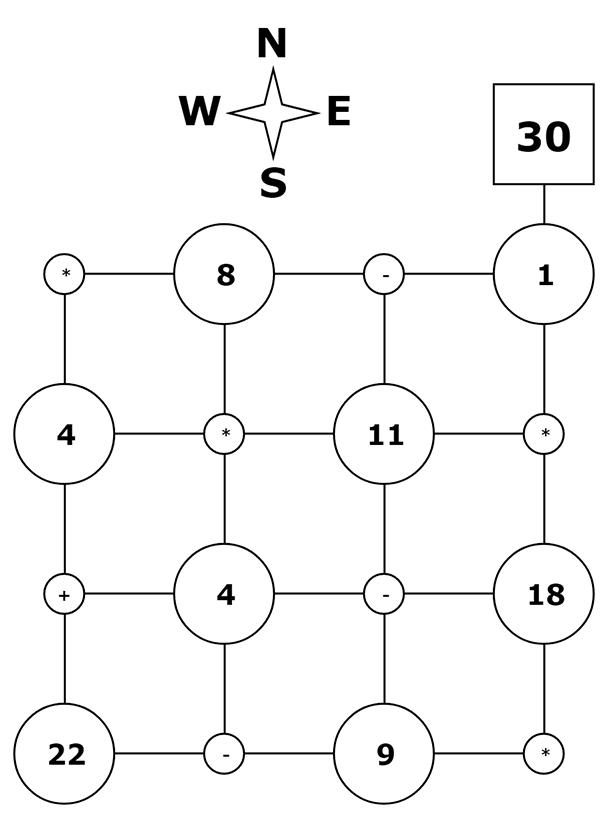

Maybe there is a specific path, a sequence to match something? The number on the door: 30! I conclude that I have to go through the symbols until they form an arithmetic expression that equals 30. I just have to generate every single path and check which one fits. Python to the rescue, as well as Graph Theory!

Buuuuut, it was actually not quite that. Per the journal and by trial-and-error, I found out that: you are allowed to go back to a previous room, so listing all paths is not trivial; there's a "time" limit, as in, maximum path length of 12 rooms; the orb shatters whenever the current total is 0 or less, as well as 32768 or more; and everytime you go back to the pedestal (room "22") or the vault door (room "1"), the orb disappears. So, with those restrictions applied, I wrote some code to just run around randomly until one of those restrictions is broken or a correct path is found. And, after a couple seconds, there it was:

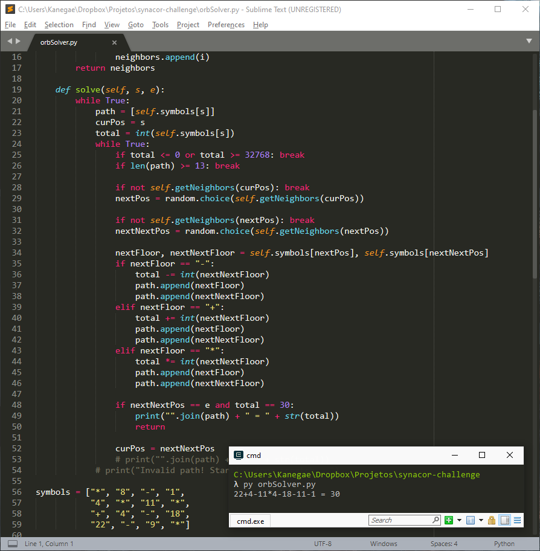

Here's the actual path, mapped out:

And that did work! Vault open!

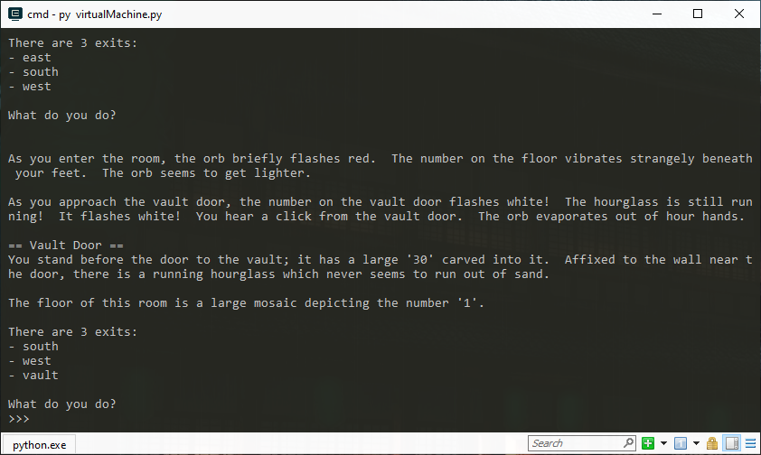

## 9. Reflecting On The Journey

Inside the vault, all the riches (also spoiled before, hehehe), and... a mirror? I guess the eight password was on me all along!

And that code isn't being accepted either. Have I, again, solved something not the way it was supposed to? Wait, all the characters are symmetrical, and I'm "reading the code from a mirror"... I'll just reverse the password string and... not yet. Huh. After a couple more minutes of head scratching, I noticed there was a "q" in my password, which, well, isn't symmetric, but, when mirrored, turns into a "p"! That was it, the final password: reverse the string and swap "p"s and "q"s, as well as "b"s and "d"s.

## 10. The End

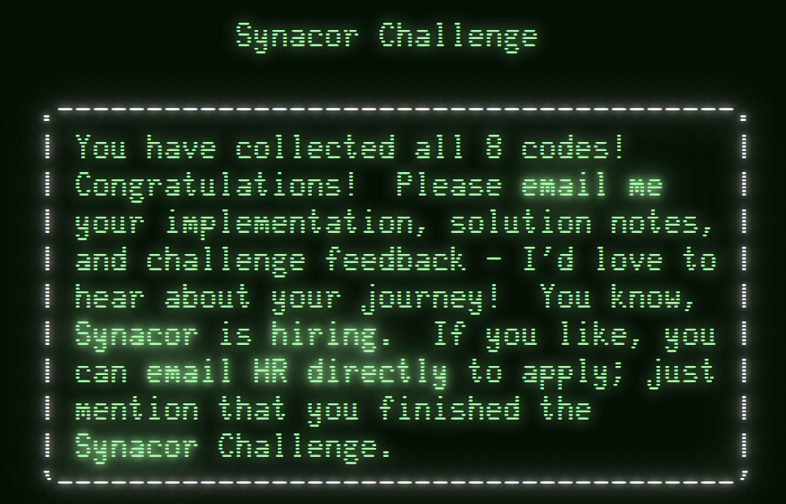

All in all, this took me around 25 hours in the span of a couple days, writing this and capturing screenshots while I played. It was really, really fun, and I definitely learned a lot with it.

Many thanks to [Eric Wastl](http://was.tl/), the challenge creator!
